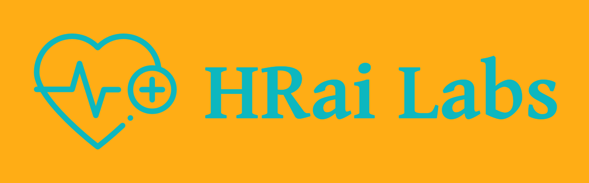

https://hrailabs.com
<br>
<br>Welcome to the equity-toolkit!
<br>
<br>Here we've provided open and transparent code that can be used for disparate impacting testing.
<br>
<br>Try out our deployed app: https://app.hrailabs.com
<br>
<br>Like to contribute? Reach out to <a href="mailto:jfeld@hrailabs.com">jfeld@hrailabs.com</a>.

<h1><b>Instructions</b></h1>

<b>Deployed app:</b>
https://app.hrailabs.com
<br>See directory for sample input file `sample_input.csv`

<b>Installation:</b>
<br>- Set up a virtual environment: `equity_toolkit`
<br>- `conda env create -f env.yaml`
<br>- `conda activate equity_tookit`

<b>File Prep:</b>
<br>- Place input csv file in `inputs` folder.
<br>- Update `config` file with parameters.

<b>Run App:</b>
`python app.py`
<br>- Navigate to local browser: http://127.0.0.1:8050/

<b>Run Model:</b>
```import yaml
import model

with open('config.yaml') as f:
    config = yaml.safe_load(f)
    
model = model.Model(config)

df_prep, tbl = model.prep()

df_result = model.analysis(df_prep.copy(), tbl)
```
